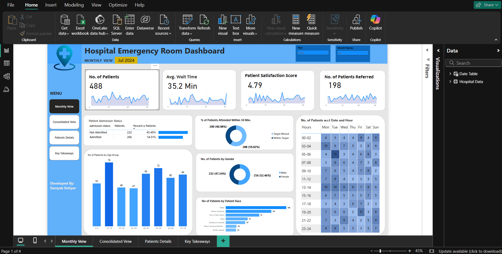
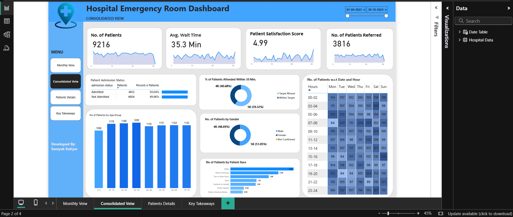
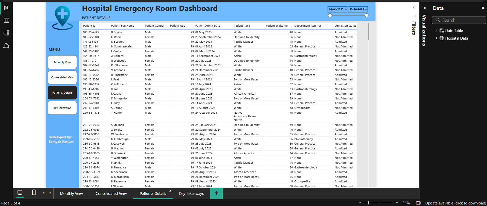

# 🏥 Hospital Emergency Room (ER) Operations Dashboard

This Power BI dashboard project analyzes and visualizes emergency room (ER) operations data to provide insights into patient volume, satisfaction, wait times, and demographic information. The goal is to assist hospital administrators and decision-makers in improving ER efficiency, reducing wait times, and optimizing resource allocation.

---

## 📌 Objective

To design an interactive dashboard that provides both **monthly** and **consolidated** overviews of key performance indicators in hospital emergency room operations.

---

## 📂 Dashboard Views

### 1️⃣ Monthly View (Sample: July 2024)

**Key KPIs:**
- 📈 **Number of Patients**: 488  
- ⏱️ **Avg. Wait Time**: 35.2 Minutes  
- 😊 **Patient Satisfaction Score**: 4.79  
- 🔄 **Patients Referred**: 198  
- 🎯 **Patients Attended within 30 Minutes**: 59.02%  
- 👥 **Gender Split**: ~52.46% Female  
- 🔢 **Age Group Distribution** and ⏰ **Heatmap by Date and Hour**

---

### 2️⃣ Consolidated View (April 2023 - October 2024)

**Highlights:**
- 📊 **Total Patients**: 9,216  
- ⌛ **Avg. Wait Time**: 35.3 Minutes  
- 😍 **Patient Satisfaction Score**: 4.99  
- 🚑 **Total Referrals**: 3,816  
- 📉 **Balanced Admission Rate** (Admitted: 50.04%, Not Admitted: 49.96%)  
- 📆 **Date-Hour Heatmap** shows peak hours and high-traffic days

---

### 3️⃣ Patient Details View

A searchable and scrollable table displaying:
- Patient ID, Name, Gender, Age  
- Admission Date, Race, Department Referral  
- Wait Time and Admission Status

---

## 🛠 Tools & Technologies Used

- **Power BI Desktop**: For creating reports and dashboards  
- **DAX**: For calculated measures and KPIs  
- **Data Modeling**: Date and Hospital ER tables  
- **Visuals**: Bar charts, donut charts, line graphs, matrix, slicers

---

## 📈 Insights Derived

- 👨‍⚕️ Peak hours are during **09:00–13:00**, especially on **Mondays and Tuesdays**  
- 👩‍⚕️ **Adolescents (10–29)** form the largest patient group  
- ⚖️ Slightly more **female** patients than male  
- 🕒 More than **59% patients** are attended within **30 minutes**  
- 🚨 High satisfaction score (4.99) indicates quality of service

---

## 📣 Contact

For queries, reach out on [LinkedIn](https://www.linkedin.com/in/samyakkatiyar/) or GitHub Discussions.

⭐ If you found this useful, don't forget to give this repo a **star**!

